# AI News Radar 部署实战手册（真实记录版）

> 这份手册不是"应该怎么做"，而是**这一次实际发生了什么**：每一步的命令、真实输出、
> 踩到的坑、以及坑是怎么修掉的。所有截图里的数字和日志都来自 2026-09-25 那次真实部署。
>
> 部署目标：`root@2001:db8:9a40:9210:4::e5`（美西 VPS，Debian 11.2，2 核 475MB）
> 部署结果：**服务在跑，Bot 在线，管理员 Telegram 已收到真实早报**；唯一未闭环项是没有 LLM Key（当前规则模式）。
>
> **隐私说明**：文中所有地址、主机名、Bot 用户名与 chat id 都是文档用的占位符（`2001:db8::/32`、`192.0.2.0/24`、`@your_news_bot`、`999999999`），配图也是用这些占位符重新生成的；真实值只存在于服务器上的 `/etc/ai-news-radar/env`(0600)。
> 图片由 `python docs/make_figures.py` 生成（需要 `matplotlib`），改完文字记得重新生成再提交。
>
> 想看"从初版到现在分别改了什么"的完整清单，读 **[CHANGELOG.md](CHANGELOG.md)**；
> 本文按事故展开细节与证据， changelog 按版本给索引。

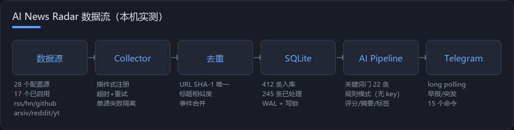

---

## 0. 开工前先确认的 5 件事

| 项目 | 本次实际情况 | 你要填什么 |
| --- | --- | --- |
| 服务器地址 | `2001:db8:9a40:9210:4::e5`（**只有 IPv6**） | 你的 IP/域名 |
| 系统 | Debian 11.2 bullseye，apt 走 `archive.debian.org` | — |
| 资源 | 2 核 / **475MB 内存 / 0 swap** / 30G 磁盘（已用 1.4G） | ≥1G 内存更舒服 |
| 机器上已有服务 | `mmwx` 143MB、`sing-box` 39MB、`cloudflared`×2、postgres | 别挤掉它们 |
| 外发能力 | `api.telegram.org` **0.41s 可达**；OpenAI/HN/arXiv/HF 全通；VentureBeat 429 | 见 §3 体检 |
| 凭证 | Bot `@your_news_bot` (id 1234567890)、管理员 chat `999999999` | 你的 token / chat id |

> ⚠️ **安全提醒**：Bot Token 和 root 密码如果在聊天/工单里明文出现过，部署完请到 @BotFather
> `revoke` 换一个新 token；本文档与仓库里都不保存真实值，只写占位符。

---

## 1. 本机准备（Windows / Git Bash）

只需要三样东西：一把部署密钥、一个能跑 paramiko 的 Python、以及项目代码。

```bash
# 1) 生成专用密钥（不要复用你日常那把）
ssh-keygen -t ed25519 -f ~/.ssh/ai_news_radar_deploy -N "" -C "qoder-deploy-ai-news-radar"

# 2) 项目虚拟环境（本机已有则跳过）
cd /d/new-shell/新闻/ai-news-radar
python -m venv .venv && .venv/Scripts/python.exe -m pip install -q paramiko
```

### 1.1 第一次登录：直连失败

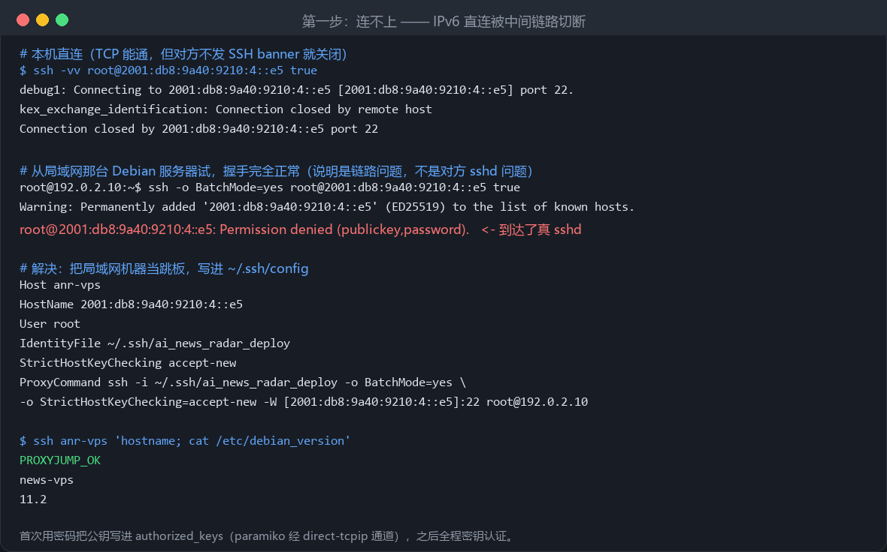

现象很典型：**TCP 能建立，但对方在发送 SSH banner 之前就关闭连接**
（`kex_exchange_identification: Connection closed by remote host`）。
同一时刻从另一台机器（局域网里的 Debian 13）连接，握手完全正常 —— 说明问题在**链路**，不在对方 sshd。
大陆出口对境外 IPv6 的 22 端口经常就是这个表现。

### 1.2 解法：把能连通的机器当跳板

先用密码 + paramiko 走一次"一次性握手"，把公钥写进目标机的 `authorized_keys`：

```python
# bootstrap_key.py —— 只在第一次用；跑完就可以删掉
import paramiko, pathlib

JUMP   = ("192.0.2.10", 22, "root")            # 这台能直连目标
TARGET = ("2001:db8:9a40:9210:4::e5", 22, "root")
KEY    = str(pathlib.Path.home() / ".ssh" / "ai_news_radar_deploy")
PUB    = pathlib.Path(KEY + ".pub").read_text().strip()

jump = paramiko.SSHClient()
jump.set_missing_host_key_policy(paramiko.AutoAddPolicy())
jump.connect(*JUMP[:1], port=JUMP[1], username=JUMP[2], key_filename=KEY,
             allow_agent=False, look_for_keys=False)

chan = jump.get_transport().open_channel("direct-tcpip", (TARGET[0], 22), ("127.0.0.1", 0))
tgt = paramiko.SSHClient()
tgt.set_missing_host_key_policy(paramiko.AutoAddPolicy())
tgt.connect(TARGET[0], username=TARGET[2], sock=chan, password="<你的服务器密码>")
tgt.exec_command(
    "mkdir -p ~/.ssh && chmod 700 ~/.ssh && "
    f"printf '%s\\n' '{PUB}' >> ~/.ssh/authorized_keys && chmod 600 ~/.ssh/authorized_keys")[0].read()
print("key installed")
```

然后把跳板固化进 `~/.ssh/config`，之后所有命令都能 `ssh anr-vps` 一条搞定：

```sshconfig
Host anr-jump
    HostName 192.0.2.10
    User root
    IdentityFile ~/.ssh/ai_news_radar_deploy

Host anr-vps
    HostName 2001:db8:9a40:9210:4::e5
    User root
    IdentityFile ~/.ssh/ai_news_radar_deploy
    StrictHostKeyChecking accept-new
    ProxyCommand ssh -i ~/.ssh/ai_news_radar_deploy -o BatchMode=yes \
        -o StrictHostKeyChecking=accept-new -W [2001:db8:9a40:9210:4::e5]:22 root@192.0.2.10
    ServerAliveInterval 30
```

```bash
$ ssh anr-vps 'hostname; cat /etc/debian_version'
news-vps
11.2
```

> 没有跳板机时的替代方案：厂商控制台/VNC 登录、或给目标机加一条 IPv4 端口转发。

---

## 2. 第 2 步：装机前体检（别跳过）

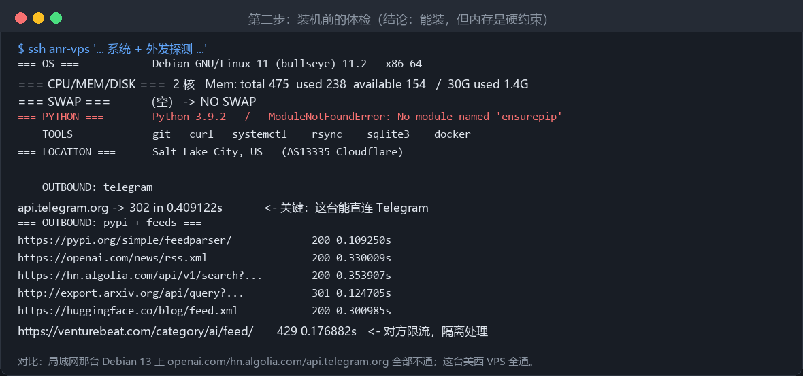

一条命令拿全信息（脚本存在本仓库 `scripts/` 之外，这里直接贴）：

```bash
ssh anr-vps 'bash -s' <<'EOS'
. /etc/os-release; echo "$PRETTY_NAME"; uname -mrs
nproc; free -m; swapon --show || echo "NO SWAP"; df -h / | tail -1
for p in python3 python3.11 python3.12; do command -v $p >/dev/null && $p -V; done
python3 -c "import ensurepip" 2>&1 | tail -1
for t in git curl rsync systemctl docker; do printf "%-9s %s\n" "$t" "$(command -v $t || echo MISSING)"; done
for u in https://api.telegram.org/ https://pypi.org/simple/feedparser/ \
         https://openai.com/news/rss.xml https://hn.algolia.com/api/v1/search?tags=front_page \
         http://export.arxiv.org/api/query?max_results=1 https://huggingface.co/blog/feed.xml; do
  printf "%-52s " "$u"; curl -sS -o /dev/null -w "%{http_code} %{time_total}s\n" --max-time 20 -A "Mozilla/5.0" "$u" || echo FAIL
done
EOS
```

**本次体检给出的三个决策**：

1. `api.telegram.org` 通 → Bot 可以跑在这台，不需要额外代理；
2. 系统 Python 3.9 → 代码要求 ≥3.10（SQLAlchemy 会在运行时解析 `Mapped[str | None]`）→ 必须换解释器；
3. 475MB 内存 + 0 swap + 已有代理业务 → **先加 swap 再谈测试**（见 §7 事故一）。

> 顺手记下"哪些源在这台机器上可用"，比事后翻日志快得多。本次结论：17 个启用源里 16 个可直连，
> 只有 VentureBeat 返回 429（对方限流，程序会隔离处理）。

---

## 3. 第 3 步：搞一个 ≥3.12 的 Python

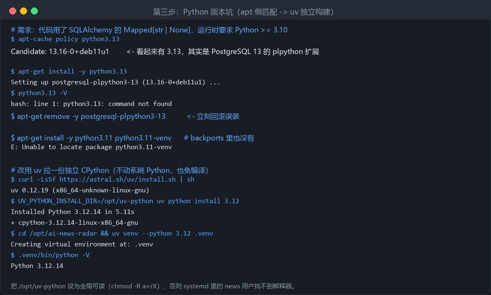

### 3.1 先别信 `apt-cache policy python3.13`

在 Debian 11 上它给出 `Candidate: 13.16-0+deb11u1` —— 那是 **PostgreSQL 13 的 plpython 扩展**，
不是 Python 3.13。`apt-get install python3.13` 会真的把那个包装上，然后 `python3.13` 依旧 command not found。
发现后立刻回滚：

```bash
apt-get remove -y postgresql-plpython3-13
```

backports 里也没有 `python3.11`（bullseye 已进 EOL 归档，包很旧）。

### 3.2 用 uv 拉一份独立 CPython（推荐）

不动系统 Python、不编译、5 秒装完，而且能放在全局可读的位置：

```bash
export UV_PYTHON_INSTALL_DIR=/opt/uv-python && mkdir -p $UV_PYTHON_INSTALL_DIR
curl -LsSf https://astral.sh/uv/install.sh | sh
install -m 755 /root/.local/bin/uv /usr/local/bin/uv

uv python install 3.12                 # Installed Python 3.12.14 in 5.11s
mkdir -p /opt/ai-news-radar && cd /opt/ai-news-radar
uv venv --python 3.12 .venv
.venv/bin/python -V                    # Python 3.12.14

chmod -R a+rX /opt/uv-python           # ← 关键：否则 systemd 里的 news 用户找不到解释器
```

---

## 4. 第 4 步：上传代码 + 安装依赖

机器上没有 rsync，用 `tar | ssh` 最省事（也顺便演示如何做"无 git 更新"）：

```bash
# 本机：打包时排除虚拟环境、数据、日志、本地 .env
cd /d/new-shell/新闻/ai-news-radar
tar czf /tmp/anr.tgz --exclude=.venv --exclude=logs --exclude=data \
    --exclude=.pytest_cache --exclude=__pycache__ --exclude="*.pyc" --exclude=.env .

# 远端解包
cat /tmp/anr.tgz | ssh anr-vps 'mkdir -p /opt/ai-news-radar && tar xzf - -C /opt/ai-news-radar'
```

依赖（版本全部在 `requirements.txt` 里钉死）：

```bash
ssh anr-vps 'cd /opt/ai-news-radar && UV_PYTHON_INSTALL_DIR=/opt/uv-python \
  uv pip install --python .venv/bin/python -r requirements.txt && \
  .venv/bin/python -c "import aiogram,sqlalchemy,feedparser,httpx,apscheduler,lxml; print(\"deps OK\", aiogram.__version__)"'
# deps OK, aiogram 3.15.0
```

---

## 5. 第 5 步：配置与密钥（这里最容易出事）

### 5.1 密钥放哪

密钥**只**放 `/etc/ai-news-radar/env`（root:root 0600），由 systemd 的 `EnvironmentFile=` 注入；
仓库里只有 `.env.example`。

```bash
ssh anr-vps 'bash -s' <<'EOS'
id -u news >/dev/null 2>&1 || useradd -r -s /usr/sbin/nologin -d /opt/ai-news-radar news
install -d -m 755 /etc/ai-news-radar
sed -e "s#^TELEGRAM_BOT_TOKEN=.*#TELEGRAM_BOT_TOKEN=<你的 Bot Token>#" \
    -e "s#^ALLOWED_CHAT_IDS=.*#ALLOWED_CHAT_IDS=<你的 chat id>#" \
    -e "s#^TIMEZONE=.*#TIMEZONE=Asia/Shanghai#" \
    /opt/ai-news-radar/.env.example > /etc/ai-news-radar/env
cat >> /etc/ai-news-radar/env <<'ENV'
DATABASE_URL=sqlite:////opt/ai-news-radar/data/news.db
DATA_DIR=/opt/ai-news-radar/data
LOG_DIR=/opt/ai-news-radar/logs
APP_ENV=production
ENV
chmod 600 /etc/ai-news-radar/env
mkdir -p /opt/ai-news-radar/data /opt/ai-news-radar/logs
chown -R news:news /opt/ai-news-radar/data /opt/ai-news-radar/logs /etc/ai-news-radar
EOS
```

### 5.2 一条必须记住的区分

| 运行方式 | 谁读 `/etc/ai-news-radar/env` | 结果 |
| --- | --- | --- |
| systemd 启动服务 | PID 1（root）通过 `EnvironmentFile=` | ✅ 正常 |
| `sudo -u news .venv/bin/python 脚本` | news 用户，0600 读不到 | 值由你手动给，或走 `.env` |
| `sudo .venv/bin/python 脚本`（root） | root 能读 | ✅ 脚本自动拿到 token |

**所以：手动跑 `scripts/*.py` 时请用 root（或先 `set -a; source /etc/ai-news-radar/env; set +a`）。**
这条区分是本次踩出来的第二个坑，详见 §7 事故二。

### 5.3 建库 + 自检

```bash
ssh anr-vps 'cd /opt/ai-news-radar && sudo -u news .venv/bin/python scripts/init_db.py && .venv/bin/python -m app.main --self-check'
```

```
database ready : sqlite:////opt/ai-news-radar/data/news.db
tables         : article_tags, articles, events, push_logs, sources, tags, user_interests, users
sources        : 28 registered, 17 enabled
...
LLM            : 不可用（规则模式）
早报/晚报      : 08:00 / 20:00
突发           : 标题里有大事件 + 一手来源 + 24 小时内 · 每天最多 5 条 · 间隔 60 分钟
```

> 这一行以前打印的是 `Breaking : threshold=90.0`。90 是给 AI 打分设的线，规则模式实测最高只有
> 78 分，所以线上突发一直是 0 条且毫无日志；现在打印的是**当前模式真正生效的判断**，
> 细节见 README §11 v1.9。

---

## 6. 第 6 步：systemd 拉起，Bot 上线

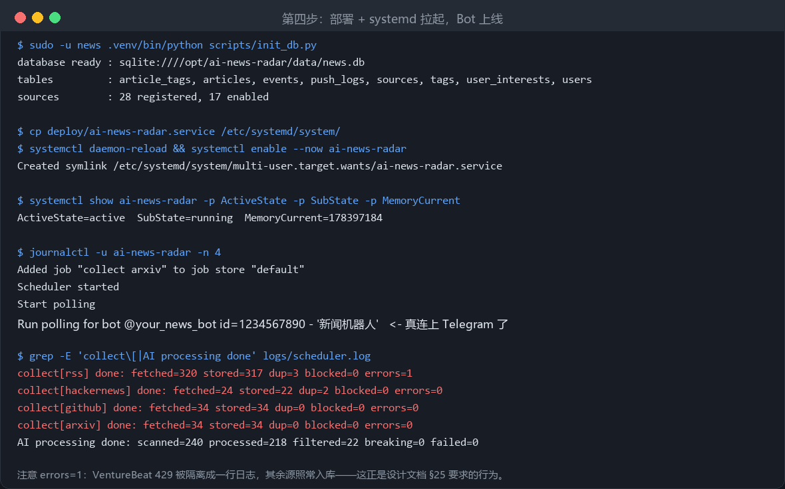

```bash
ssh anr-vps 'cp /opt/ai-news-radar/deploy/ai-news-radar.service /etc/systemd/system/ && \
  systemctl daemon-reload && systemctl enable --now ai-news-radar && sleep 10 && \
  systemctl show ai-news-radar -p ActiveState -p SubState -p MemoryCurrent && \
  journalctl -u ai-news-radar -n 4 --no-pager'
```

单元文件里三处是这次踩坑后加的，值得理解而不是照抄：

```ini
[Unit]
StartLimitIntervalSec=600        # ← 必须在 [Unit]，放 [Service] 会被 systemd 静默忽略
StartLimitBurst=5

[Service]
Restart=always
RestartSec=10
RestartPreventExitStatus=3       # 退出码 3 = 配置缺失，重启一万次也不会好
TimeoutStopSec=30
ReadWritePaths=/opt/ai-news-radar/data /opt/ai-news-radar/logs
```

### 6.1 验证 Telegram 真的能收到

```bash
ssh anr-vps 'cd /opt/ai-news-radar && .venv/bin/python scripts/telegram_smoke.py --text "部署自检"'
# token ok: @your_news_bot (id=1234567890)
# chat 999999999: 已送达，去 Telegram 看

ssh anr-vps 'cd /opt/ai-news-radar && .venv/bin/python scripts/telegram_smoke.py --digest'
# chat 999999999: 已发送 1/1 条简报消息
```

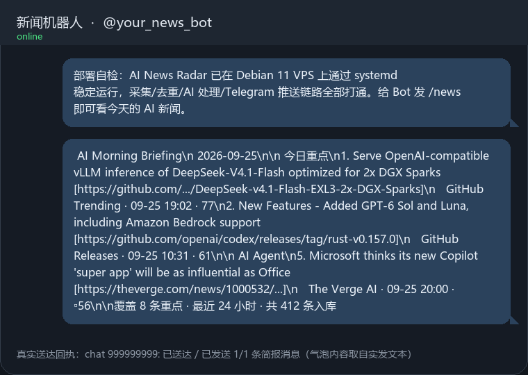

此刻你的手机上应该已经有两条消息（一条自检、一条当日早报）。
在 Telegram 里给 Bot 发 `/news`，会看到带 1️⃣2️⃣3️⃣ 按钮的新闻列表；点数字看详情，点"AI 深度分析"走强模型。

---

## 6.5 中文输出（本次新增的改动）

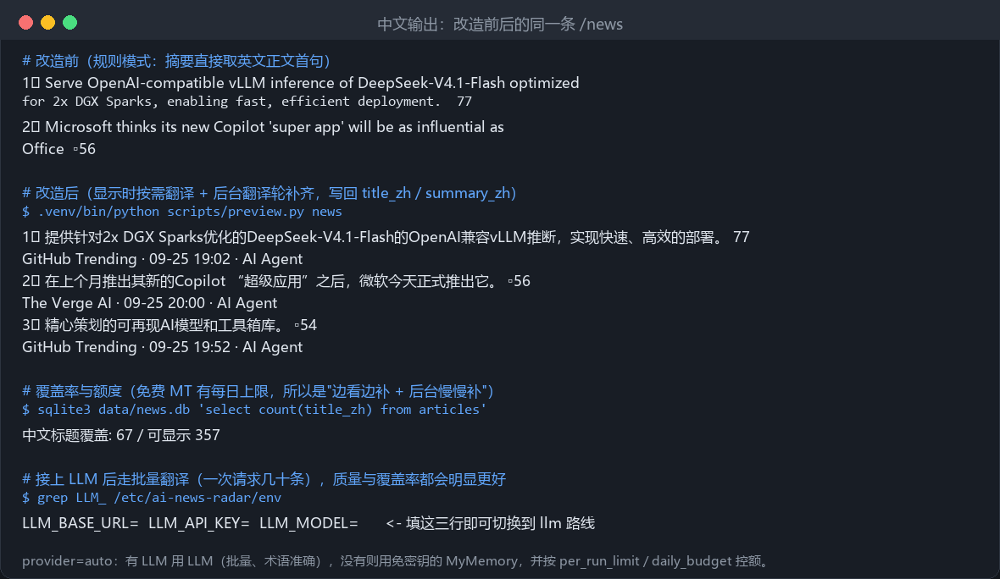

### 为什么刚部署完看到的是英文

上游几乎全是英文源，而中文摘要原本依赖 LLM。这台机器当时**没有配 API Key**，
系统就退到"规则模式"：摘要直接取英文正文首句 —— 于是列表和早报满屏英文。
这是设计上的降级（新闻不能因为模型不可用就消失），但显示语言不该跟着降级，所以现在单独修。

### 现在的机制

| 环节 | 有 LLM Key | 没有 LLM Key |
| --- | --- | --- |
| 中文摘要 | 模型直接产出中文结构化摘要（最佳） | 走翻译通道补中文标题/摘要 |
| 翻译 provider | `auto` → 用 LLM 批量翻译（一次几十条，术语按 `translate_prompt` 保留英文） | `auto` → 用免密钥的 MyMemory |
| 触发时机 | 后台每轮处理后补齐 + **你打开列表/早报时当场补当前这几条** | 同左 |
| 落库 | `articles.title_zh` / `summary_zh` / `translated_by` | 同左 |
| 显示优先级 | `summary_zh` > `title_zh` > 原文 | 同左 |

原文永远保留，去重仍基于原文；翻译失败只会退回英文，**不会丢新闻**。
检索两边都查（v1.18 起）：`title/summary/why_it_matters` 之外还查 `title_zh/summary_zh`，
因为品牌词按设计不译——他打「英伟达」时要靠 `settings.yaml` 的 `search.aliases` 走到 `NVIDIA`。

### 免密钥路线的实测结论（省得你再试）

| 路线 | 结果 |
| --- | --- |
| `translate.googleapis.com`（gtx 免密钥端点） | ✗ 机房 IP 直接返回 "Sorry..." HTML 页 |
| `edge.microsoft.com/translate/auth` | ✗ 返回空 body，后续 401 |
| `lingva.ml` | ✗ 上游同样是 Google，返回未翻译原文 |
| `api.mymemory.translated.net` | ✓ 可用，但**按 IP** 每日限额，超了返回 429 + `MYMEMORY WARNING` 正文 |
| `translate.google.com/translate_a/t`（gtx） | ✓ **机房 IP 也能通**，实测能出正常中文；注意与上一行那个 `translate.googleapis.com` 不是同一个端点 |

因此 `provider: auto` 现在是真的会往下链：**LLM → MyMemory → Google 网页端点**。
之前它名叫 auto 实则只走 MyMemory —— MyMemory 一旦 429，我们的接受校验（必须含中文、
必须与原文不同）会正确拒绝那句警告文本，于是**整批静默留在英文**，日志里只有一句 debug。
现在：

- 路由返回 429 或 `MYMEMORY WARNING` → 记 60 分钟退避，本轮之后直接跳过，不再空转；
- 一条路由没翻出来的，**剩下的继续交给下一条**；
- Google 返回的行数与请求条数不一致时**整批丢弃**（宁可留英文，也不能把 A 的标题贴到 B 上）；
- `translated_by` 记录**真正服务它的那条路由**（`last_route`），不是配置里的偏好，
  否则运维看数据库会被误导。

实测（MyMemory 当日额度已耗尽的美西 VPS）：一次 `translate_pending` 译出 60 行，
早报 10 条标题 10/10 中文。

另外两件省额度的事：`v1.2 released in owner/repo`、`owner/repo (N stars)` 这类
**模板标题不再送翻译**，由 `localize_title()` 直接拼中文（并有一个开机时跑的
`repair_template_titles()` 修历史数据，不花 token）；机翻爱写的音译
（克劳德 / 迪普西克）由 `PROPER_NOUNS` 换回原文，`&amp;#128064;` 这类双重转义实体
在入库与展示两处都会被解码。

### 相关配置（`config/settings.yaml`）

```yaml
app:
  language: zh          # 想要原文就改 en
translate:
  enabled: true
  provider: auto        # auto | llm | mymemory | google | off
  per_run_limit: 60     # 每轮最多翻译多少条
  daily_budget: 400     # 每天最多多少次请求（免费额度保护）
  rounds_per_run: 2     # 每轮处理结束后连翻几批
  prefer_translated_title: true
```

### 覆盖率与额度

本次跑完是 **67 / 357**。免费额度决定了"每天大约能自动补 200 条"，
所以策略是：**你正在看的这几条一定先翻**（`ensure_chinese` 在渲染前调用，结果写回库，只付一次成本），
剩下的由后台每 10 分钟的翻译轮慢慢补。想一次性全量、且术语准确，就接 LLM：

```bash
# /etc/ai-news-radar/env 里加三行，然后 restart
LLM_BASE_URL=https://api.deepseek.com/v1
LLM_API_KEY=<你的 key>
LLM_MODEL=deepseek-chat
```

切换后 `translated_by` 会变成 `llm`，一次请求批量翻几十条，额度不再是瓶颈。

> 免费 MT 的术语会有偏差（例如把 inference 翻成"推断"、把 release 翻成"发布版本"），
> 专有名词保留是提示词在管，但机器翻译不听提示词。**要真正能读，建议尽快接 LLM。**

### 升级方式（已部署的机器）

代码同步后直接跑 `scripts/init_db.py` 即可 —— 它会 `ALTER TABLE` 补上
`title_zh` / `summary_zh` / `translated_by` 三个新列，**不用重建库、不会丢历史新闻**：

```bash
cd /opt/ai-news-radar && .venv/bin/python scripts/init_db.py && systemctl restart ai-news-radar
```

---

---

## 6.9 `/免费`：现在哪些 agent / 模型能白嫖

新增命令。Telegram 的官方命令名只允许 `a-z0-9_`，所以菜单里是 `/free`，
但 `/免费`、`/白嫖`、`/mianfei` 都注册在同一个 handler 上，
直接说「最近有什么可以白嫖的模型？」也会命中。

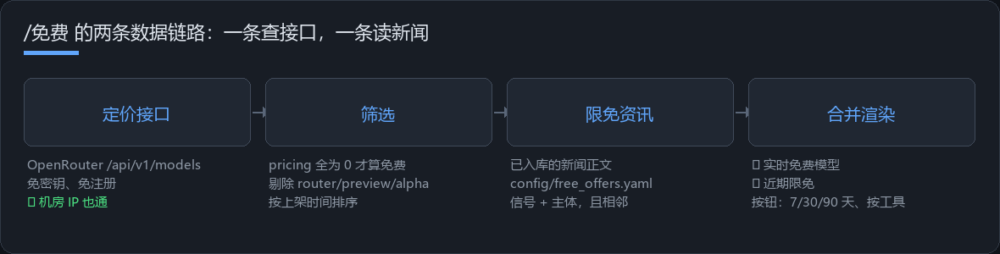

### 答案由两部分拼成

| 部分 | 数据来源 | 能回答 | 不能回答 |
| --- | --- | --- | --- |
| ⚡ 实时免费模型 | `free.models.url`（默认 OpenRouter `/api/v1/models`，免密钥） | **此刻**哪些模型 0 价，模型 id 复制进 opencode / Zcode / Cline 就能用 | 厂商自己站内的活动 |
| 🎁 限免资讯 | 已采集的新闻正文，靠 `config/free_offers.yaml` 词表判定；中文主力源是 `Linux.do 福利分类`（需要 `browser_tls`，见事故三） | Qoder / Zcode / Claude Code 这类 **agent** 的限免公告、送的额度、截止日期 | 没被任何源写到的促销 |

两部分的定位不同，所以**别把它们看成同一个东西**：
实时块是查接口查出来的事实，限免资讯是从新闻里识别出来的说法，
判断依据（命中的信号词、主体、有效期）会一起打印出来，方便你自己复核。

真实发出去的消息长这样（左边是你发的命令，右边是 Bot 的回复）：

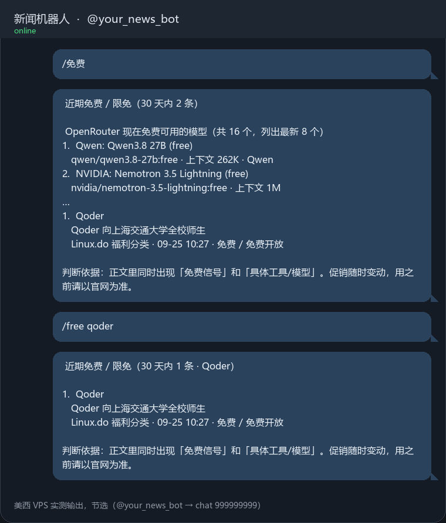

### 部署后怎么验收

```bash
cd /opt/ai-news-radar
sudo -u news .venv/bin/python scripts/preview.py free --days 30     # 看渲染结果，不发邮件不打扰 bot
sudo -u news .venv/bin/python scripts/telegram_smoke.py --free      # 真实发到你的 chat
sudo -u news .venv/bin/python scripts/telegram_smoke.py --free --query glm
```

第二轮上线时美西 VPS 上的真实输出（截断）：

```
live free-model check: 16 free model(s) at source
token ok: @your_news_bot (id=1234567890)
chat 999999999: /免费 已送达（2 条资讯，含实时免费模型，1095 字）
chat 999999999: /免费 已送达（1 条资讯，无实时块，224 字）      # --query qoder
```

两个数分别对应两部分数据源：

- `2 条资讯` = 词表在已入库新闻里认出来的限免（linux.do 福利分类入库后立刻出现，
  其中一条就是「Qoder 向上海交通大学全校师生开放」）；
- `16 free model(s)` = 定价接口此刻真实的 0 价模型数，会随上游变动。

如果 `0 条资讯` 且 `live free-model check` 也没打出来，先看是不是没装 `curl_cffi`
（`Linux.do 福利分类` 会 403）以及定价接口是否可达 —— 两者都失败时命令仍然会
返回一句明确的「没采到」，不会凭空编。

顺带确认这三件事：

- `data/free_models.json` 生成了 → 首次观测时间开始累计，之后会显示「已免费 N 天」；
- 服务用户能写这个文件（属主是 `news`）→ 写不进去只会有一行 warning，命令照样返回；
- `journalctl -u ai-news-radar | grep free` 有 `free-offer scan: N of M article(s) marked`
  → 启动时的历史回扫跑过了，改词表不用重新采集。

免费层「变化」的历史记在 `data/free_models.json` 的 `last_free` / `names` 两个键里。
想确认 diff 逻辑通了，可以把历史里的一条抹掉再快照一次（只动状态文件，不动新闻库）：

```bash
cd /opt/ai-news-radar
sudo -u news .venv/bin/python - <<'SNIPPET'
import asyncio, json
from app.config import get_config
from app.services.free_models import FreeModelWatcher

w = FreeModelWatcher(get_config())
asyncio.run(w.snapshot(force=True))
st = json.loads(w.state_path.read_text(encoding="utf-8"))
gone = st["last_free"][0]
st["last_free"] = st["last_free"][1:]
w._write_state(st)

fresh = FreeModelWatcher(get_config())
asyncio.run(fresh.snapshot(force=True))
print("pretended", gone, "was unseen -> newly free:", [m.id for m in fresh.newly_free])
SNIPPET
```

期望看到 `newly free: ['<刚抹掉那条>']`；跑完再执行一次 `/免费`，状态会被写全。
**第一次快照 `trend()` 返回空是设计**（否则刚部署就会把整个免费层当成"新增"），
不要以为它没生效。

主动推送（`free.alert`）的验收：每轮 AI 处理结束后会把新出现的限免推一次，
实测日志 `free-offer alert delivered to 1 chat(s), 3 offer(s)`；被推过的行会写
`articles.free_offer_sent_at`，所以重启 / 再跑一轮都不会重复播报。冷却 90 分钟、
每人每天 4 条上限，`/pause` 之后立刻安静。定价接口里**新**出现的 0 价模型也走这条通知，
但第一次快照只登记不播报（否则刚部署就会刷一屏）。

### 词表怎么扩（不改代码）

```yaml
# config/free_offers.yaml
tools:
  MyNewAgent:
    aliases: [mynewagent, "my new agent"]
    kind: Agent        # Agent / 平台 / 模型，决定同一句里谁优先
signals_zh: [免费, 限免, 白嫖, 送额度]
false_friends: [camera-free, free software, feel free]
```

- 加完重启即可：启动时会用新词表回扫全部历史新闻，
  **收紧规则后旧的误报也会被撤掉**（`backfill_free_offers` 会清空不再成立的标记）。
- 正文里的信号必须「出现在标题里」或者「与主体相邻」（`body_max_distance`），
  否则「我自己跑着不要钱」这种用法描述会被当成官方限免 —— 这就是第一版踩的坑。

---

## 7. 事故复盘（这部分最值钱）

### 事故一：pytest 被 OOM 杀掉（exit=137）

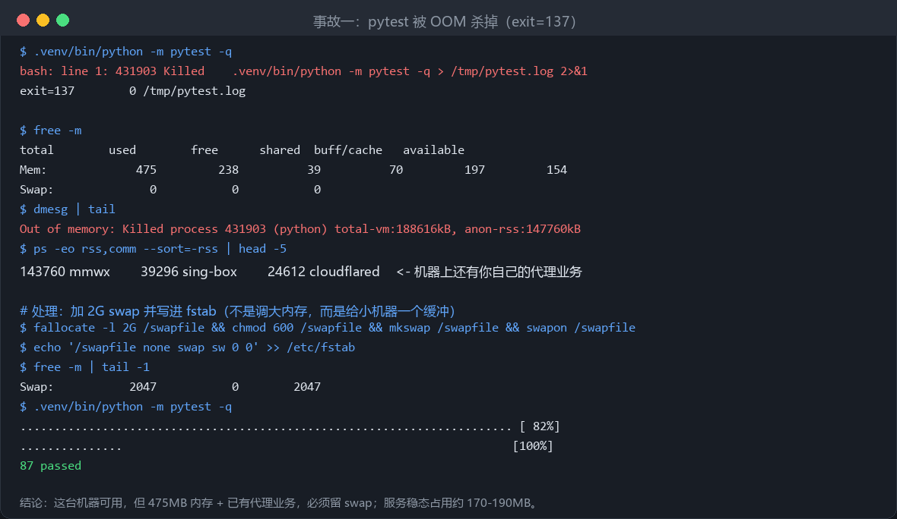

- **现象**：测试进程直接消失，`/tmp/pytest.log` 是 0 行，shell 报 `Killed`，`exit=137`。
- **定位**：`free -m` 显示 475MB 总内存、0 swap、available 154MB；`dmesg` 里
  `Out of memory: Killed process 431903 (python) anon-rss:147760kB`。机器上还跑着 `mmwx`/`sing-box`/`cloudflared`。
- **修复**：加 2G swap 并写进 `/etc/fstab`，之后 `87 passed`。
- **预防**：部署前体检就要看 `free -m` + `swapon --show`；小内存机器把 `llm.process_batch_size`
  和 `max_batches_per_run` 调小（例如 20 / 3），能明显压低峰值。

### 事故二：给配置读文件加"便利"，把服务打进重启循环

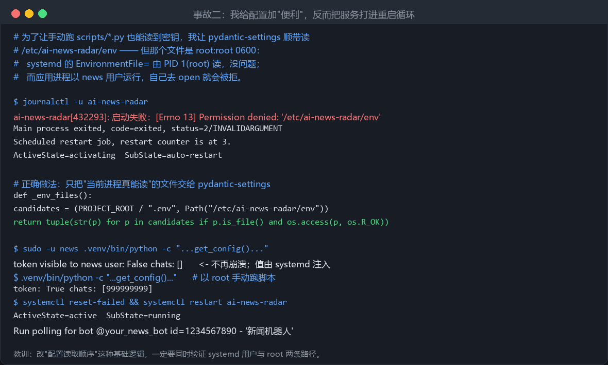

- **起因**：为了让你手动跑 `scripts/telegram_smoke.py` 也能拿到 token，我让 `Settings` 顺带读
  `/etc/ai-news-radar/env`。
- **现象**：`启动失败：[Errno 13] Permission denied: /etc/ai-news-radar/env` → `status=2` →
  `Scheduled restart job, restart counter is at 3` → 服务起不来。
- **根因**：那个文件是 root:root 0600。systemd 用 PID 1(root) 读它没问题；
  但应用进程是 `news` 用户，自己去 `open()` 必然被拒 —— 我把"谁能读"这件事搞混了。
- **修复**：只把**当前进程真能读**的文件交给 pydantic-settings：

  ```python
  candidates = (PROJECT_ROOT / ".env", Path("/etc/ai-news-radar/env"))
  return tuple(str(p) for p in candidates if p.is_file() and os.access(p, os.R_OK))
  ```

- **预防**：改配置加载这类基础逻辑，必须同时验证 **systemd 用户** 和 **root 手动** 两条路径；
  本次已把这两条路径写成 `tests/test_deployment.py` 的用例。

### 事故三：把"能白嫖的信源"当成"能连上的信源"

给 `/免费` 找中文限免信源时，`linux.do` 的福利分类看起来最合适。
用 `curl` 试：`200`、63KB，皆大欢喜；改完代码上线，日志里却是：

```
collector Linux.do 福利分类 failed: https://linux.do/c/welfare/36.rss -> HTTP 403
```

同一台机器、同一个出口 IP、同一个 UA，`curl` 通、`httpx` 不通。
差别只在 TLS 指纹：Cloudflare 按 JA3 认出这是 Python 客户端，
直接返回"Just a moment..."挑战页（有时表现为 403，有时是 429）。
叠加上重试就更糟：`attempts: 2` + 同轮请求两个 linux.do 地址，
第一次过、第二次必被限流。

顺带一个运维常识：`config/sources.yaml` 是**同一份文件，但两台机器的网络位置不同**。
美西 VPS 上 `Linux.do 福利分类` 一轮入库 24 条；国内那台（192.0.2.10）连 `curl` 都 25 秒超时，
于是每轮白等一个 `ConnectTimeout`。这类源就在**那台机器的本地 config 里**关掉，
并在文件里留一行原因注释 —— 不要为了"两边一致"把一个源在能用的机器上也关掉。

三条可复用的结论：

1. **验收信源要用真实客户端**，不要 `curl` 一把就算过：
   `.venv/bin/python scripts/test_sources.py` 走的就是 app 里的 httpx，能直接暴露这类差异。
2. **但 403 不等于"这台机器进不去"**。拦你的是 TLS 握手指纹（JA3），不是 IP：
   同一台机器、同一个出口、同一秒，`curl` 200 而 `httpx` 403。
   解法是用 `curl_cffi` 复刻真实 Chrome 握手 —— 本项目里就是一个源级开关
   `browser_tls: true`（见 `app/collectors/base.py`）。装上之后同一台 VPS 实测
   `Linux.do 福利分类: 24 new of 25 fetched`，`/免费` 当场出现真实限免。
   没装 `curl_cffi` 时会自动回落 httpx 并留一行 warning，不会崩。
   顺带一个 Windows 坑：venv 路径里有中文时 curl 读不了 `certifi` 的 CA 文件
   （`curl: (77)`），所以这台开发机上别拿 browser_tls 源做验证。
3. Reddit 的 `search.rss` 比 `/hot/.rss` 更容易 429（对机房 IP 尤其明显），
   同轮请求三个 subreddit 端点必挂两个。

顺带记两个细节：

- Discourse 的 `/c/welfare.rss` 会 301 到 `/c/welfare/36.rss`，
  配置里要写**带分类 id 的规范地址**，否则会跟着重定向撞进挑战页。
- 中文社区标题不带空格，`限免100刀DeepSeekv4.1Flash` 会把 `` 边界打断，
  而"智谱"这种两字公司名会被"别名长度 ≥3"的过滤掉。两个坑都已在
  `app/processing/free_offers.py` 修掉，并各留了一个回归用例。

### 事故四：定时推送没带 parse_mode，早报里全是字面 <b> 标签

交互式回复（`/news`、`/免费`）用的是 `message.answer(..., parse_mode="HTML")`，
看起来一切正常；但**调度器主动推送**走的是另一个出口 `TelegramSender.send()`，
那里从来没传 `parse_mode`。Telegram 默认按纯文本渲染，于是早报正文里的
`<b>今日总体判断</b>`、`<a href=...>阅读原文</a>` 会原样出现在聊天里。

这类"两条出口共用一个渲染器"的 bug 只会在一边发作，所以：

- 渲染层只产 HTML（`app/services/format.py` 统一 `esc()` / `link()`）；
- **出口层负责声明它是 HTML**，`TelegramSender.send()` 默认 `parse_mode="HTML"`；
- Telegram 因为某条标题没转义好而 400 时，**降级成纯文本重发一次**，
  而不是把整条早报丢掉 —— 一条脏数据不该吃掉当天的新闻。

`tests/test_browser_tls.py` 里那三个 `FakeBot` 用例就是钉死这三点的。

### 事故六：常驻 177MB 的元凶是 aiogram，不是"泄漏"

小内存机器上第一反应都是"是不是泄漏了"。先量，别猜：

```bash
PID=$(systemctl show -p MainPID --value ai-news-radar)
grep -E "^(VmRSS|RssAnon)" /proc/$PID/status      # RssAnon 才是真的堆内存
```

`RssAnon 177MB` 说明不是页缓存。接着按模块量导入成本（每个 import 后读一次
`/proc/self/status`），结果一目了然：

| 模块 | 匿名内存增量 |
| --- | --- |
| yaml + pydantic + sqlalchemy + httpx + feedparser + bs4 + apscheduler | 合计 +31MB |
| **aiogram** | **+106MB** |

一个只跑采集的进程凭什么付这 106MB？答案是"不该付，但代码让它付了"：
`app/bot/__init__.py` 在包级别 `from app.bot.bot import ...`，
而 `app.main` 又 `from app.bot.bot import BotNotConfigured`，
`run_forever()` 更是在函数开头无条件 `import app.bot.bot` ——
于是 `--no-bot` 模式、`--once`、每个 CLI 脚本都被拖着加载整个 Telegram SDK
（aiogram 会为全部 Bot API 类型建 pydantic 模型，这才是大头）。

改法三处，都不复杂：

1. `BotNotConfigured` 挪到 `app/bot/errors.py`（一个异常类不该要求装 SDK）；
2. `app/bot/__init__.py` 改成 PEP 562 的 `__getattr__` 懒解析；
3. `run_forever()` 里把 bot 相关 import 移进 `if with_bot:` 分支。

实测效果（国内那台只采集、没有 bot token）：

```
VmRSS    201MB ->  85MB
RssAnon  177MB ->  63MB      # 省掉 ~114MB，约 57%
```

带 bot 的美西 VPS 仍是 ~175MB（它确实要用 aiogram），重启后
`Start polling → Run polling @your_news_bot` 正常。

回归防线是 `tests/test_deployment.py::test_collection_mode_does_not_import_aiogram`：
它在**子进程**里 `import app.main` 然后断言 `sys.modules` 里没有 aiogram ——
以后谁再往共享模块顶层加一句 `from aiogram import ...`，CI 就会红。

### 事故四之二：GitHub 源"没抓到"其实是"没配额"

日志里连续几天都是这种句子，看起来完全正常：

```
collector GitHub Releases: 0 new of 0 fetched
collector Coding Agent Releases: 0 new of 0 fetched
```

真相是：`/etc/ai-news-radar/env` 里那行 `GITHUB_TOKEN` 是**注释掉的**（`grep -c` 数得到它，
所以第一次排查还以为配了），匿名配额 **60 次/小时**已经被 `GitHub Trending` 一个源吃光。
 releases 模式下每个仓库每轮要一次请求，27 个仓库 ≈ 54 次/小时 —— 匿名额度根本不够分，
 于是每个仓库都拿到 403，而 `_releases()` 把 403 当"这个仓库没有 release"用 `log.debug`
 咽掉了。**静默的空转比报错危险**：它长得像"今天没有新闻"。

现在三层都补上了：

1. `GitHubCollector.get()` 读 `x-ratelimit-remaining` / `-reset`；配额为 0 时
   **一个请求都不发**，直接抛 `CollectorError`，日志变成：
   ```
   collector GitHub Releases failed: GitHub API 匿名配额只有 60 次/小时，已用完；
   在 /etc/ai-news-radar/env 里设 GITHUB_TOKEN=<PAT> 可放宽到 5000 次/小时（约 22 分钟后恢复）
   ```
2. 403 是从异常里抛出来的（拿不到 header），所以失败路径会去问一次**不计配额**的
   `/rate_limit` 确认真实状态；结果缓存 60 秒，同一轮不会反复去问。
3. 启动时如果没 token 且在看 releases 仓库，直接 `log.warning` 算给你看需要多少次/小时。

**你要做的一件事**：去 https://github.com/settings/tokens 建一个**无权限**的 classic token
（public data 都读得到，不需要任何 scope），写进 `/etc/ai-news-radar/env`：

```
GITHUB_TOKEN=ghp_xxx          # 注意别写成 #GITHUB_TOKEN=...
```

然后 `systemctl restart ai-news-radar`。在那之前，GitHub 的 releases / trending
基本是残缺的，`/免费` 依赖的那份"agent 自家 changelog"也就看不到。

**但不配 token 也不该这么贵**，后来又补了两刀（2026-09-26 上线）：

1. **条件请求（ETag）**：`github.py` 把每个 URL 的 `etag` + 响应体存进
   `data/github_etags.json`，下一轮带上 `If-None-Match`。GitHub 对返回 304 的请求
   **不扣配额**，所以"没变的仓库"变成免费。生产实测同一台机器连跑两轮：

   ```
   08:26:30 github GitHub Releases: 18 metered + 0 free 304     ← 冷缓存
   08:29:22 github GitHub Releases: 3 metered + 15 free 304     ← 热缓存
   08:29:24 github Coding Agent Releases: 2 metered + 6 free 304
   ```

   27 个仓库从 26 次/轮降到 5 次/轮，而且**重启不再等于重新烧一轮配额**（缓存在磁盘上）。
   剩下的几次里，一部分是**真的发了新 release**，一部分是"这仓库压根没发过版"的 404。
   404 现在也记进同一份缓存（`missing_until`，默认 6 小时后再问），日志因此多一列 `known-empty`：
   `github GitHub Releases: 4 metered + 13 free 304 + 1 known-empty, quota left=...`。
   实测本机 27 个仓库目前只有 `qodo-ai/qodo-gen` 属于这种，所以这项眼下只省 1~2 次/轮，
   等 watch 列表里加了还没发过版的 agent 才开始起作用 —— 写在这里是为了别把它当成大头的来源。
   每一轮的花销都会记在 `logs/collector.log` 里，`grep metered logs/collector.log` 就能看到。
2. **`GitHub Trending` 其实在查三个 topic 的交集**：GitHub 的限定词是 AND 语义，
   原代码把 `searches:` 列表拼成 `topic:ai topic:llm topic:agents`，等于只要同时打了
   三个标签的仓库 —— 实测量：近两周 `stars:>=10` 的交集只有 4 个，`topic:ai` 单独查有 26 个。
   现在每个条目各发一次查询（`max_search_calls` 控制一轮最多几次，默认 2 次 = 2 配额），
   并且给"新建仓库"加了 `min_new_stars: 10` 门槛 —— 之前入库的全是
   `someone/刚建的小仓库 (0 stars)` 这种标题。上线后第一轮就是
   `collector GitHub Trending: 25 new of 25 fetched`（此前长期是 `0 new of 25`）。

### 事故四之三：429 被当成网络抖动，重试三遍、下一轮再来一遍

`VentureBeat AI` 六小时内失败 **69 次**，全部是 HTTP 429。翻数据库才发现它
**一条新闻都没贡献过**（0 行）：429 在 `BaseCollector.get()` 里走的是"可重试"分支，
所以一轮里连打三次（间隔 0.5~1 秒），五分钟后下一轮再打三次 —— 对方已经在说"你太快了"，
我们的回应是问得更勤。

现在 `app/collectors/base.py` 里有一段通用的退避：

- 429 **不再在同一轮重试**，改为按主机记录冷却；
- 等待时长优先取 `Retry-After`（支持秒数和 HTTP date 两种写法），
  其次是 `x-ratelimit-remaining: 0` + `x-ratelimit-reset`（Reddit 就是这样，
  而且它给的是 `0.0`，所以解析必须是浮点而不是 `isdigit()`）；
  两个都没有就退到 `backoff_minutes`（默认 30，可按源覆盖），并夹在 30 秒 ~ 6 小时之间；
- 一个**返回 200 但 `remaining: 0`** 的响应同样提前进入冷却 —— 那是还没发生的 429；
- 冷却期间 `get()` 直接抛错、**一个包都不发**，`/来源` 里能看到中文原因。

在 VPS 上对着真实的 VentureBeat 跑两轮，用计数代理记录实际发出的请求：

```
round 1: RateLimited: ... HTTP 429，源服务器要求降速，已退避 30 分钟
    requests sent so far: 1  cooling={'venturebeat.com': 1800}
round 2: CollectorError: ... 源服务器要求降速，还剩 29 分钟再试
    requests sent so far: 1  cooling={'venturebeat.com': 1800}
```

一小时的请求数从 ~12 次降到 2 次。至于 VentureBeat 本身：**已 `enabled: false`** ——
它的 WAF 对这个机房 IP 段直接 429 且不给 `Retry-After`，浏览器 UA、curl、
curl_cffi 三种方式实测都一样，而 TechCrunch / The Verge / Ars 覆盖了同样的新闻。
保留一个永远失败的源只会污染 `error_count`，看不到就是没有。

### 事故四之四：08:00 的早报没来，日志里一个字都没有

今早 08:00（Asia/Shanghai）的早报没有发出，`journalctl` 和 `logs/*.log` 里既没有
"delivered" 也没有 "skipped"，看起来跟"今天本来就没内容"一模一样。查数据库
（`push_logs` 里最近一条 `morning` 还是更早我做验证时手动发的那次，UTC 09-25 22:22
= 北京 09-26 06:22，本来就不在调度时间里）才确认它确实没发。

原因是两个都合理的东西凑到了一起：

- 早报由 `digest watcher` 每 `DIGEST_CHECK_MINUTES = 5` 分钟检查一次，
  过期时间是 `DIGEST_GRACE_MINUTES = 45` 分钟；
- APScheduler 的 interval job **第一次执行是在启动后 5 分钟**，
  而我今天为了部署反复重启，2-3 分钟一轮，每个进程都没活到第一次检查。

也就是说：**服务"在跑"，但没有任何一次检查落在 08:00–08:45 里**，这一天的早报就 quietly 没了。

改了两处：

1. `digest watcher` 现在带 `next_run_time=now + DIGEST_STARTUP_DELAY(120s)`，
   启动两分钟内就检查一次（重复发送本来就不可能，`_digest_due` 按本地日去重）。
   生产验证：`09:06:12` 启动 → `09:08:12` 第一次检查，正好 +120 秒。
2. 错过窗口不再沉默：

   ```
   09:08:12 WARNING jobs.py - morning digest for 999999999 missed its 08:00 window
   - no check ran within 45 minutes of it, so it will not be sent today
   ```

   同类还有"今天已经发过"的 INFO，两者都按 (用户, 种类, 日期, 时间) 去重，不会每 5 分钟刷一条。

顺带一条排查经验（写在这是为了下次别再踩）：`news.collector` / `news.scheduler`
这些 logger **不往 root 传**，所以它们的内容只出现在 `logs/<subsystem>.log` 里，
`journalctl` 只能看到 pipeline 打的 `collector X: N new of M fetched` 摘要；
而日志文件用的是北京时间（`TZ=Asia/Shanghai`），数据库里的 `created_at` 是 UTC，
对时间线时要差 8 小时。

### 事故四之六：官方公告永远进不了简报 —— 因为 RSS 只给了一句话

按源统计"7 天内有多少条够得上简报"（`final_score >= 55`）之后暴露出来的：

```
  Google DeepMind     eligible=0   平均分 33.5  最高 54.2
  Hugging Face        eligible=0   平均分 29.5  最高 50.9
  NVIDIA Developer    eligible=20  平均分 53.3  最高 76.9
  Reddit LocalLLaMA   eligible=19  平均分 43.5  最高 70.6
```
（统计窗口：近 7 天入库的行，`eligible` = `final_score >= 55` 的行数）

DeepMind 和 Hugging Face **最高分都够不到 55 的门槛**，也就是无论发什么都不会出现在早报里；
而论坛帖轻松过关。差的不是内容，是**正文长度**：这些官方 feed 的条目只有
36–288 个字符（`len(content)` 实测），规则模式下 importance/relevance 全靠关键词命中数
（`28 + 4.5 * hits`），一句话能命中的词就那么多 —— 而 `source_quality` 明明给到 95，
却只占 10% 权重。换句话说：**摘要越短的源被系统性低估**。

修法是把设计文档 §6 里写了、但一直只用来清洗 feed 描述的 BeautifulSoup 真正用起来：
`app/processing/enrich.py` 对短于 `enrich.min_chars`（默认 600）的条目去抓原文页面，
`extract()` 取 `<article>`/`<main>`/`<body>` 里的 `p/li/h2/h3`，丢掉 nav/aside/script
和 "Subscribe / Related posts / All rights reserved" 这类噪声。
预算与礼貌：每轮最多 `max_per_round: 5` 次；失败或被 403/429 拒绝的主机
**复用采集器的退避表**（`cooling`/`cool_down`），一小时内不再敲第二次。
抓到之后只**加分不减分** —— 关键词闸门用原文重算命中数，但不会因为原文没命中的条目
把已经入库的新闻撤回（实测就有一页 HF 文档式页面抽出 6.8 KB 却零命中）。

生产实测，同一行 `id=170`（标题 “Hugging Face Models on Foundry”）：

```
抓取前：content=46ch  final_score=41.7  （低于 55，进不了简报）
抓取后：content=12000ch final_score=64.4 meta.enriched=1
        summary="At Microsoft Build 2026, we announced Foundry ..."
日志：  fetched 1 article page(s) for full text
        AI processing done: scanned=1 processed=1 filtered=0 failed=0
```

顺带被这行勾出来的另一个 bug：为了复现它把这行改回未处理，结果处理时崩在
`INSERT INTO article_tags` 的联合主键上 —— `attach_tags()` 不幂等，
任何"第二次处理同一行"（降级行的补跑、重排队）都会炸。
现在只附加还没挂上的标签，`tests/test_pipeline.py::test_reprocessing_a_row_does_not_duplicate_its_tags`
钉住它（把修复回退掉，这条测试会以 `UNIQUE constraint failed: article_tags...` 失败）。

**存量数据怎么办**：抓正文只发生在"条目正在被处理"的那一刻，而库里已经躺着
48 小时内 328 条短正文（OpenAI 51、DeepMind 50、HF 49…），它们会带着进不了简报的分数一直躺到过期。
所以每个处理轮开始前会先 `requeue_stubs()` 把**最接近门槛**的若干条重新排队
（按 `final_score` 倒序，每轮 `max_per_round` 条，只碰 36 小时内的行，
`meta.enriched` 记录尝试结果 —— 抓过的不再敲，避免每次轮次都去骚扰一个拒我们的主机）。
一开始我把它挂在启动时，实测发现那是个假补种：**一次启动只消化 5 条**，
所以挪到了每一轮。线上：

```
10:50:33 INFO requeued 5 stub article(s) for full text
10:50:35 INFO AI processing done: scanned=5 processed=5 filtered=0 failed=0     ← 2.6 秒
```

改完之后官方源的可达性开始变化：这五个源里 `final_score >= 55` 的行数现在是 3
（HF 64.4、TechCrunch 59.3 等），其中 **DeepMind / Hugging Face 这两个此前 7 天最高只有
54.2 / 50.9 的源，第一次有行越过了门槛**；另有 3 条被标成"抓过但没抓到东西"，不会再重试。
每轮 5 条、10 分钟一轮 = 30 条/小时，48 小时窗内的 328 条存量要 **约 11 小时**才能全部试过一遍
（`backfill_hours: 36` 保证队列不会变成无限工程）。

### 事故四之七：翻译队列只认标题，377 条摘要永远是英文

抓正文之后会把 `summary_zh` 清空（旧译文译的是旧文本，不能留），结果发现它们**再也没有被重新翻译**：
`repo.untranslated_articles()` 的过滤条件是 `title_zh IS NULL` —— 标题已经译过的行，
无论摘要缺不缺，都不再进队列。线上量到 **377 行**有英文摘要、没有中文摘要
（Reddit 67、GitHub Trending 57、OpenAI 44、NVIDIA 43、arXiv 42、TechCrunch 32）。
同一段循环里还有第二个洞：模板标题（`v1.2 released in owner/repo` 这种）走 `continue` 提前跳出，
所以**每一条 GitHub release 的摘要都没机会被翻译**。

两处一起改：队列过滤条件变成 `title_zh IS NULL OR summary_zh IS NULL`，
循环里标题与摘要**各自独立**处理（模板分支不再跳过摘要）。线上效果：

```
11:06:16 translated 1/1 article(s) to Chinese via google      ← 修复前的轮次
11:18:42 translated 60/60 article(s) to Chinese via google    ← 修复后
11:18:44 translated 60/60 article(s) to Chinese via google
11:30:49 translated 60/60 article(s) to Chinese via google
待译摘要 377 -> 258 -> 150（每轮 120 条）
```

因为标题与摘要共用同一个日配额（`translate.daily_budget: 400`、`per_run_limit: 60`），
队列顺带加了一条排序原则：**缺标题的行排在只缺摘要的行前面**，否则这条 377 行的摘要补种
会把配额吃光，让新文章的标题变成英文 —— 那才是读者唯一必看的一行。线上验证：
最近 3 小时入库的文章里，`title_zh is null` 的数量是 **0**（11 篇标题+摘要都已中文）。
`tests/test_translate.py::test_a_missing_headline_outranks_a_missing_summary` 钉住这个顺序。

修好之后简报的每一行都是中文，而且按重要性排列：

```
🔥 今日重点
1. 询问有关任何文本或 JSON 的键入问题，并在几毫秒内获得校准答案。   Hacker News ⭐78
2. 7 月份，当 700 名 OpenAI 代理入侵 Hugging Face 时，他们留下了公开的证据。  HN ⭐76
3. 更改内容在网关提示标头中添加了“x-claude-code-prompt-id”…        GitHub Releases 🔹72
```

注意一个反直觉的差别：**摘要缺失不会立刻毁掉简报**，因为 `ensure_chinese()` 会在发送前
当场补齐它要显示的那 8-10 条。真正的代价是（1）`/新闻` 这类列表视图一直显示英文，
（2）简报发送时要现挂一串翻译请求（慢、且挤在 45 分钟窗口里更容易出事），
（3）免费翻译提供方的日配额被"临时补"而不是"后台批量补"浪费掉。

### 事故四之九：`/新闻` 第 4 条的"标题"是 `由 /u/pmv143 提交 [链接] [评论]`×3

Reddit 的链接帖在 RSS 里除了这句页壳什么都不给，而且给三遍：

```
content: 'submitted by\n/u/pmv143\n[link]\n[comments]\n' ×3
summary: 'submitted by /u/pmv143 [link] [comments] ...'   ← 规则摘要照着它编
zh:      '由 /u/pmv143 提交 [链接] [评论] ...'              ← 还花了翻译配额
```

于是**列表页的第一行就是这段页壳**，而真正的标题 `At this point, OpenAI should be nationalized.`
被挤到看不见。原有的 `strip_feed_boilerplate()` 只认识 linux.do 的两种页壳
（`20 posts - 17 participants`、`Read full topic`），英文的 `submitted by` 都不在表里，
中文形式更是没有任何规则能命中 —— 因为清洗发生在**显示时**，那时文本已经被翻译过了。

三处一起补：

1. `strip_feed_boilerplate()` 认得 `submitted by /u/x`、`[link] [comments]`、
   `crossposted from /r/x`、`edited by /u/x` 以及它们的中文版（`由 /u/x 提交`、`[链接]`、`[评论]`），
   并且会把"同一段被粘贴 N 遍"折回一份（先按词、再按字符找周期，中文没有空格也能命中）。
   尾巴上被页壳带出来的 ASCII 分隔符一并去掉，**全角中文标点一律不碰**
   （这条规则原有测试就为了它）。
2. `fallback_summary()` 在切句之前先清洗正文，**新的行不会再拿页壳编摘要**，
   也不会再把它送进翻译队列浪费日配额；正文只有页壳时退化成"用标题当摘要"。
3. 存量行不迁移：显示层已经能认出中文页壳，`display_summary` 变空之后
   `display_line` 自然回落到标题 —— 线上立刻见效，无需改数据库：

```
修前  4️⃣ 由 /u/pmv143 提交 [链接] [评论] 由 /u/pmv143 提交 [链接] [评论] …
修后  4️⃣ 此时，OpenAI应该国有化。
```

**仍然没解决、留在这里的一件事**：`display_line` 是"中文摘要 > 中文标题 > 标题"，
所以 Reddit 这类行的第一行显示的是正文首句（"大约两年前，我创办了一家合同审查软件公司…"），
而不是帖子标题（`card` 视图显示的却是标题，两个视图不一致）。改成"标题优先"会动到
一个先前有意做的设计决定（注释写着"避免只显示一句干巴巴的摘要"），
对官方新闻源那种"摘要比标题信息量大"的行也确实更好 —— 所以它需要的是**按来源区别对待**，
不是一刀切翻转。下次动它之前先把这个取舍想清楚。

### 事故四之八：`数据源：37 个` 数的是配置文件，不是活着的东西

`/stats` 那行 `🔌 数据源：37 个` 里，37 是 `sources.yaml` 的条目数 —— 其中 **17 个是关着的**
（Anthropic、Meta AI、Mistral、InfoQ、5 个 subreddit、YouTube、V2EX、xAI、VentureBeat…）。
它既不说哪些真在出新闻，也不说哪些在报错，而 `/sources` 才有那些细节，于是这条
"健康摘要"实际上什么都没摘要。`news.stats()` 的 `sources` 字段就是这个数，
`start.py`（判断是不是第一次运行）、`jobs.startup_report()` 和状态行都吃它。

改成三项，语义都限定在"启用的"里面：

```
🔌 数据源：20 启用 / 37 配置 · 近 24 小时出过新闻 20 个        ← /stats
AI News Radar online: 20/37 sources enabled, 20 delivered in 24h, 639 article(s) in db,
llm=off(rules only), chats=999999999                          ← 启动日志
```

`sources_delivering` 用 `repo.sources_that_delivered()` 从 articles 表 distinct 出来，
再和启用集合取交；`sources_failing` 只统计**启用的**且 `error_count > 0` 的源，
为 0 时整段后缀不显示（干净的系统不该占一行字数）。
`tests/test_pipeline.py::test_status_line_reports_enabled_sources_not_the_config_file`
钉住这三件事。顺带一条经验：`stats()` 以前**一个测试都没有**，所以这个错标签一直活着 ——
用户能看到的数字，值得一个断言。

### 事故四之五：简报排的是"最新"，不是"最重要"

`_briefing()` 拿的是 `news.latest(...)[:top_items]`，而 `latest()` 里写死了
`order_by_score=False` —— 于是"今日 10 条重点"实际上是**最近入库的 10 条**。
在生产库上按今晚的真实参数（`evening`、12 小时窗口、min_score 55）量了一次：

```
OLD (newest-first)[:8]  -> Reddit LocalLLaMA 4, GitHub Releases 2, TechCrunch 1, Ars 1   分数 56-72
NEW (best-first, cap 3) -> AWS ML 3, GitHub Releases 2, TechCrunch 2, Reddit 1           分数 62-72
```

八条里四条是"杰夫的炒作让我很生气"这种论坛帖标题，而同一窗口里分数更高的 17 条
一条都没进来。更糟的是它和"哪个源恰好最后抓完"绑定 —— 我修好 `GitHub Trending`
一轮入库 25 条之后，这种偶发性会被放大。

改成两层：

1. **按分数选**：`latest(order_by_score=True)`（`repo.query_articles` 本来就支持，
   只是没人用），其它调用方（`/最新`、搜索兜底）保持按时间，不受影响。
2. **每个源限量**：`digest.max_per_source: 3`，超出配额的挤到 overflow；
   当天内容不够时再回填，**不会为了规则而少发**。纯函数
   `digest.select_briefing()` 单独可测，`tests/test_pipeline.py` 里
   有用例钉住这三件事（限量、回填、顺序）。

顺手修了显示层的另一个问题：摘要与标题都用了 `[:150]` / `[:110]` 硬切，
生产里出现过 `…with a wall of `、`Topics: ai` 这种断在半句的线。
现在统一走 `normalize.shorten()`：在标点（中文没有空格）或空格处断开并加 `…`，
切点不会早于限制的 60%，并且不会把 HTML 实体切成一半。
**产生摘要的地方也一起改了**（`summarizer.fallback_summary` 里的
`first[:160]` 是真正的源头），同时它现在会先解码实体 —— 摘要永远是给人看的文本，
不是 URL，所以这里解码是安全的。

已经入库的旧数据不会被"以后修好了"救回来，所以启动时多了一个幂等的修补过程
`repair_truncated_summaries()`：只重算规则模式那批行的摘要（AI 写的不动），
并且把从断句翻译出来的 `summary_zh` 清空让它重译。生产实测：

```
09:42:28 INFO main.py:129 - re-cut 79 truncated summary line(s)
09:46:55 INFO main.py:129 - re-cut 2 truncated summary line(s)      ← 补上带实体的两行
（之后每次启动都不再打印：0 行需要修，幂等）
select count(*) where summary like '%&#%' or '%&amp;%'  -> 0
```

### 事故五：`or 默认值` 把配置里的 0 吃掉了

限免推送的冷却时间想临时设成 0 做验证，结果怎么都是 `cooldown 90m`：

```python
cooldown = int(self.cfg.get("cooldown_minutes", 90) or 90)   # 0 or 90 -> 90
```

`get(key, default)` 已经处理了"键不存在"，后面那个 `or` 是为了防 YAML 里写空值，
但它顺手把**合法的 0** 也当成"没填"。这类写法在配置项上特别隐蔽：
默认值越正常，bug 越看不出来 —— 冷却 90 分钟本来就是对的，于是没人怀疑它。

现在统一走 `app.config.as_int / as_float`：只有 `None` 和空串回落默认值，
`0`、`0.0`、`"0"` 都按字面值算，非数字则记一条 warning 再回落。
`tests/test_free_alerts.py` 里钉了两个用例：`as_int(0, 90) == 0`，
以及 `cooldown_minutes: 0` 时 `_may_send` 必须放行。

顺带一条排障经验：**在服务器上临时覆盖配置做验证时，别用两个 `asyncio.run()` 共用一个
aiogram Bot** —— 第一个 loop 关闭后 Bot 里的 aiohttp 会话就废了，
报的是 `RuntimeError: Event loop is closed`，跟被测代码一点关系没有。放进一个 `main()` 里跑完。

### 之前那台机器上修掉的问题（同样适用于这台）

| 问题 | 后果 | 修复 |
| --- | --- | --- |
| 采集与 AI 处理并发写 SQLite | `database is locked`，一轮 240 条只落 2 条 | 写任务串行锁 + 分批重试 + `busy_timeout=30s` + 处理任务延后首跑 |
| 缺 token 时 5 秒无限重启 | 采集一起停摆，日志刷屏 | 退出码 3 + `RestartPreventExitStatus=3` |
| 网络异常日志为空串 | 无法排障 | `describe_error()`：URL + 异常类名 + 文本 |
| 早报按"昨天整天"取窗 | 漏掉隔夜新闻、日期显示成昨天 | 滚动 24h/12h 窗口，标题日期为当天 |
| 社区源能刷到 breaking 分数 | 随机仓库被判重大新闻 | 可信度分级封顶（C=78 / D=68） |
| release 正文的 `## 标题` 漏进摘要 | Telegram 上像坏数据 | 正文提取时降级 Markdown 标记 |

---

## 8. 日常运维

一条命令把当前代码发到所有已部署机器并自检（服务是否 active、迁移是否真的落库）：

```bash
scripts/deploy.sh                 # 默认 anr-vps anr-jump
scripts/deploy.sh anr-vps         # 只发一台
```

它存在的理由有两条，都是真实踩过的：

1. 一次手工 `tar | scp | ssh tar x` 把**旧包**解到了第二台机器上，
   那台机器看起来一切正常，跑的却是旧代码；
2. 脚本自己也会坑人 —— 第一版里写的是 `state=$(systemctl is-active ai-news-radar)`，
   而 `is-active` 对 failed 单元**返回非零退出码**，在 `set -e` 下这行直接把远程脚本
   打断，"撞上限流就 reset-failed 重试"的那段根本没执行到。
   结果一次普通部署把服务留在了 failed 状态约 90 秒。
   现在两处读取都写成 `... || true`，失败时还会顺手打印最后 8 行日志，
   省得再上去 `journalctl`。

脚本最后会打印
`service=active schema=ok stamp=<时间戳>`（schema 那一项是真的去 `PRAGMA table_info`
里数了列，确认迁移落库），任何一项不对就非零退出，且不会因为一台失败就跳过剩下的机器。

还有一个会反复踩到的坑：**连着重启两次会撞上 `StartLimitIntervalSec`**，
systemd 直接 `start-limit-hit` 把服务标成 failed，而应用本身毫无问题
（日志里上一条还是干净的 `Succeeded`）。脚本因此会 `reset-failed` 后再试一次；
手工排障时记得 `systemctl reset-failed ai-news-radar && systemctl start ai-news-radar`，
别对着一个根本没报错的程序找 bug。

```bash
# 状态与日志
ssh anr-vps 'systemctl status ai-news-radar --no-pager | head -12'
ssh anr-vps 'journalctl -u ai-news-radar --since "-2 hours" --no-pager | tail -30'
ssh anr-vps 'tail -20 /opt/ai-news-radar/logs/collector.log'      # 哪个源挂了

# 手动补一轮采集 + 处理（不影响服务）
ssh anr-vps 'cd /opt/ai-news-radar && .venv/bin/python -m app.main --once'

# 看 Telegram 会收到什么（不发出去）
ssh anr-vps 'cd /opt/ai-news-radar && .venv/bin/python scripts/preview.py digest'
ssh anr-vps 'cd /opt/ai-news-radar && .venv/bin/python scripts/preview.py news'
ssh anr-vps 'cd /opt/ai-news-radar && .venv/bin/python scripts/preview.py ask "最近 OpenAI 有什么新闻？"'

# 数据源体检（不写库）
ssh anr-vps 'cd /opt/ai-news-radar && .venv/bin/python scripts/test_sources.py -v'

# 备份（整个状态就一个文件）
ssh anr-vps 'cd /opt/ai-news-radar && .venv/bin/python -c "
import sqlite3,shutil; shutil.copy(\"data/news.db\",\"/root/news-\$(date +%F).db\")" '

# 更新代码（无 git 流程：本机重新打包 → 覆盖 → 重启）
cd /d/new-shell/新闻/ai-news-radar && tar czf /tmp/anr.tgz --exclude=.venv --exclude=logs \
  --exclude=data --exclude=.env --exclude=__pycache__ --exclude=.pytest_cache --exclude="*.pyc" . \
  && cat /tmp/anr.tgz | ssh anr-vps 'tar xzf - -C /opt/ai-news-radar && \
     cd /opt/ai-news-radar && UV_PYTHON_INSTALL_DIR=/opt/uv-python uv pip install --python .venv/bin/python -r requirements.txt && \
     chown -R news:news data logs && systemctl restart ai-news-radar'
```

改数据源只需要动 `config/sources.yaml` 然后 `systemctl restart ai-news-radar`：

```yaml
  - name: My AI Blog
    type: rss
    url: https://example.com/feed.xml
    enabled: true
    quality: B          # A 官方 / B 媒体 / C 社区 / D 个人
```

---

## 9. 验收清单

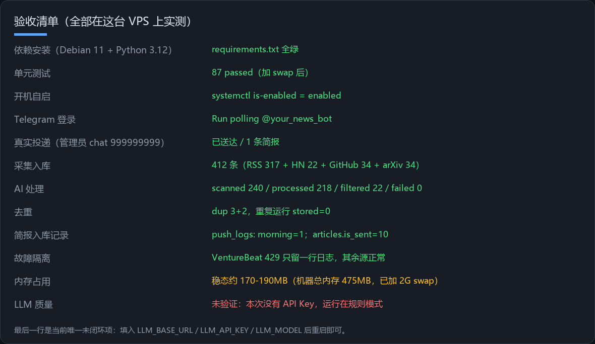

---

## 10. 下一步（按优先级）

1. **接 LLM**（当前唯一未闭环项）。现在跑的是规则模式：新闻照常采集/去重/分类/推送，但摘要是正文首句、分类精度低。
   到 `/etc/ai-news-radar/env` 里加三行后 `systemctl restart ai-news-radar`：

   ```bash
   LLM_BASE_URL=https://api.deepseek.com/v1     # 或 OpenAI / OpenRouter / 硅基流动 / Ollama
   LLM_API_KEY=<你的 key>
   LLM_MODEL=deepseek-chat
   LLM_LIGHT_MODEL=deepseek-chat                # 分类/摘要用便宜的
   LLM_STRONG_MODEL=deepseek-reasoner           # 深度分析/早报总评用强的
   ```

   验证：`.venv/bin/python -m app.main --once` 后 `scripts/preview.py digest`，摘要应变成中文一句话总结。

2. **让 Telegram 主动推**：早报/晚报时间来自 `users` 表（默认 08:00 / 20:00，Asia/Shanghai），
   你也可以在 Telegram 里用 `/settings` 直接改；`/setinterest 我主要关注 AI Agent、开源模型、GPU` 会改变评分权重。
3. **国内那台 Debian 13**（192.0.2.10）：它连不上 Telegram，但采集侧 14/17 源可用。
   两种用法：① 当作纯采集节点（已配 `no-bot` 覆盖）；② 若你给它配了代理，在 env 里填
   `TELEGRAM_PROXY=http://127.0.0.1:7890` 与 `HTTPS_PROXY=...` 即可完整运行。
4. **可选加固**：`systemd` 已用非 root 用户 + `ProtectSystem=full`；再进一步可给 SQLite 目录做每日快照、
   给 `logs/` 配 journald 上限（`SystemMaxUse=200M`）。

---

## 11. 常见问题速查

| 症状 | 原因 | 处理 |
| --- | --- | --- |
| `Connection closed by remote host` 连 SSH | 出口链路干扰 | 走跳板机 `ProxyCommand`（§1.2） |
| `Unable to locate package python3.x` / 装出错的东西 | Debian 11 无新版 Python，`python3.13` 会误匹配 plpython | 用 uv 装独立 CPython（§3.2） |
| `ModuleNotFoundError: No module named ensurepip` | 系统 python 缺 venv | 同上，别用系统 python |
| 服务 `activating (auto-restart)` 循环 | 多为配置读取/权限 | `journalctl -u ai-news-radar -n 20`；退出码 3 表示配置缺失 |
| `Permission denied: '/etc/ai-news-radar/env'` | 以非 root 用户跑脚本 | 用 root 跑，或 `set -a; source` 后跑 |
| pytest `Killed` / exit 137 | 内存不足 | 加 swap（§7 事故一）或调小批次 |
| 某源一直 429/超时 | 对方限流或网络不通 | `scripts/test_sources.py` 定位；`enabled: false` 或换镜像源 |
| Telegram 收不到消息 | 从没给 Bot 发过消息 / 拉黑了 | 先在 Telegram 点 START；`chat not found` 就是这个原因 |
| 不知道自己的 Chat ID | — | 白名单为空时给 Bot 发任意消息，拒绝回复里会直接告诉你 ID |
